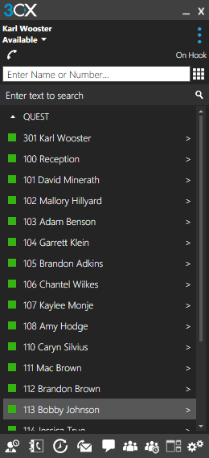

# Quest Tools

## HipChat Script
This is a compiled [AutoHotKey](https://autohotkey.com/ "AutoHotKey's Homepage") script that makes it easy to change HipChat status. Automatically switches back to active window.

Now also changes Teams status. Teams doesn't support messages with the status. Brackets indicate what will happen in Teams vs. what happens in HipChat.

Now *also* changes 3CX status. 3CX **does** support messages, but that adds a lot of complexity, so not currently supported here. {} indicate what 3CX will do when different than Teams.

+ Ctrl+F1 - Available
+ Ctrl+F2 - Do Not Disturb On Phone [Do Not Disturb]
+ Ctrl+F3 - Away Back ~{current time + 15 rounded **UP** to nearest 5 minutes} [Be Right Back] {Away}
+ Ctrl+F4 - Away PM Me [Be Right Back] {Away}
+ Ctrl+F5 - Away {prompt for message} [Away]
+ Ctrl+F6 - Do Not Disturb {prompt for message} [Do Not Disturb]

## 3CX Script
This is a compiled [AutoHotKey](https://autohotkey.com/ "AutoHotKey's Homepage") script that makes it easy to switch to 3CX and enter a number.

Simply press CTRL+ALT+\ (the one above the Enter key) to switch to the open 3CX window and clear any existing number and get ready to input a number.

Ability to copy-paste text into 3CX. Same restrictions apply (see below)

__Usage__
+ Click in a number field in GM
+ Press _F11_

Make sure to have 3CX running or you'll get an error message

Also, a real limitation is that it must be on the screen that allows direct number entry:

## GMSearch Script
This is a compiled [AutoHotKey](https://autohotkey.com/ "AutoHotKey's Homepage") script that makes it easy to search for a contact in GM.

Simply press CTRL+ALT+= to get a message box asking for the contact's name (same as you would in the search field in the upper left corner of GM). It will then do the search for you and return the results in GM.

Make sure to have GM running or you'll get an error message

## Window Switching Script
Quick switching to commonly open windows

+ Ctrl+Shift+F1 - HipChat
+ Ctrl+Alt+F1	- View HipChat for 500ms (quick-check status)
+ Ctrl+Shift+F2 - Remote Desktop (must include "gm rdp" in title bar)
+ Ctrl+Shift+F3 - Outlook
+ Ctrl+Shift+F4 - slack
+ Ctrl+Shift+F5 - Firefox
+ Ctrl+Shift+F6 - GoToMeeting
+ Ctrl+Shift+F7 - Chrome
+ Ctrl+Shift+F8 - SOLIDWORKS
+ Ctrl+Shift+F9 - 3CX

On my keyboard, I have those programmed to (in order):
+ fn+h
+ (n/a)
+ fn+g
+ fn+o
+ fn+s
+ fn+f
+ fn+m
+ fn+c
+ fn+w
+ fn+x

**_Please submit issues/comments/suggests using Issues on GitHub_**

\- Xenon
